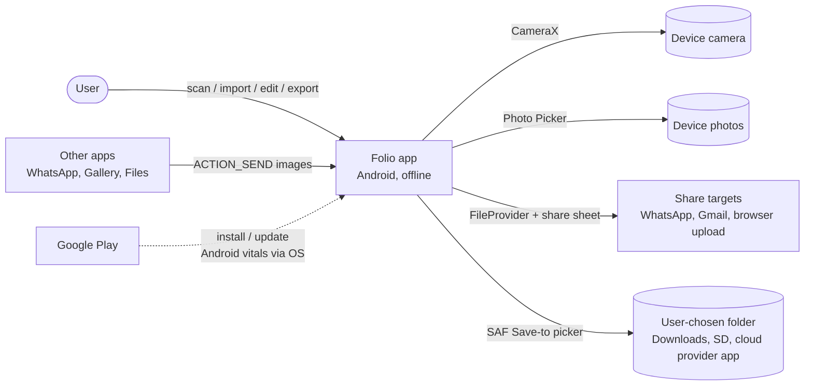
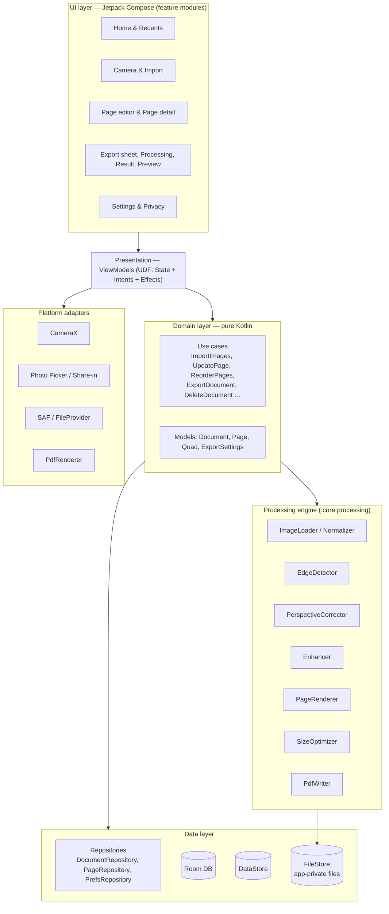
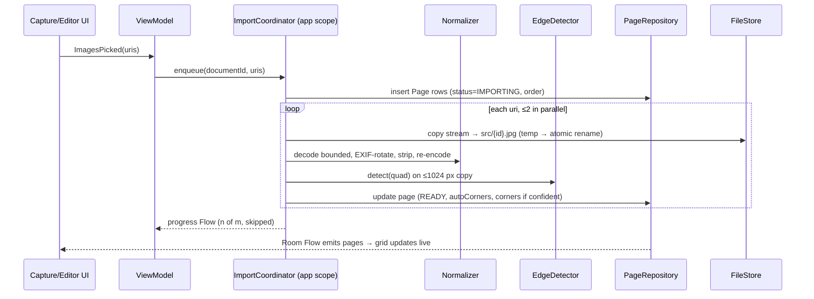
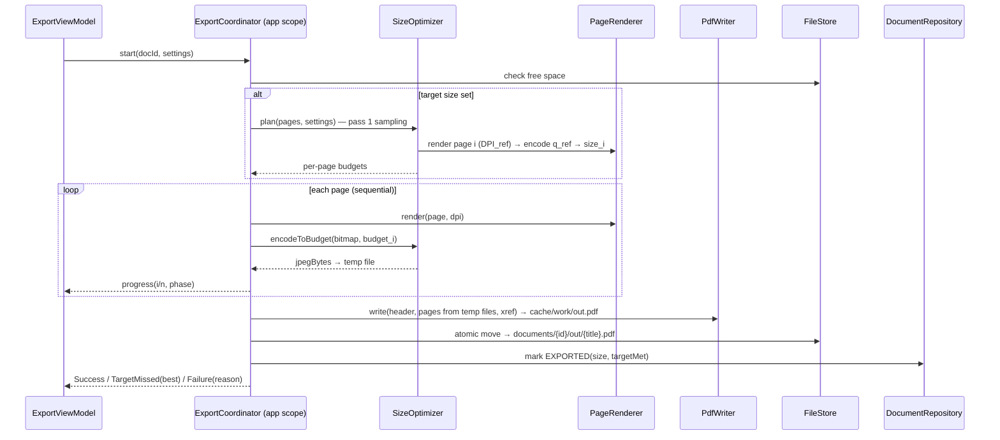
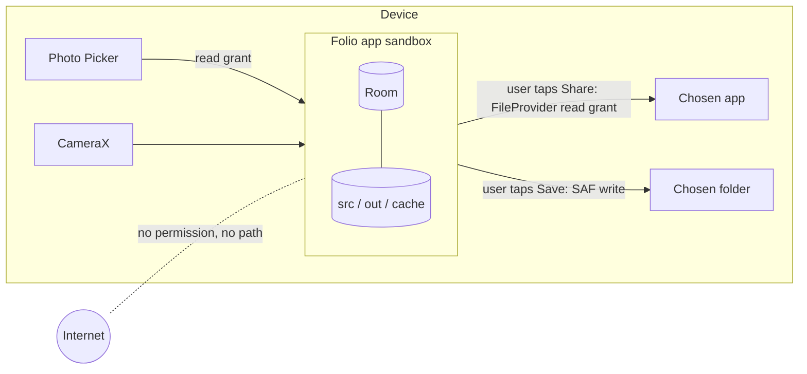

# Folio — High-Level Architecture (HLD)

**Status:** Proposed for build · **Date:** 2026-10-06 · **Related:** [LLD](02-low-level-design.md), [Tech stack](03-tech-stack.md), [ADRs](adr/)

---

## 1. Architectural drivers

These are the forces that shape every decision below, ranked.

| # | Driver | Source | Architectural consequence |
|---|---|---|---|
| 1 | **Privacy you can verify:** nothing leaves the device | FR-29/30/33, D-03 | No network stack at all. No INTERNET permission, enforced in CI. No cloud backup. No third-party SDKs that phone home |
| 2 | **No data loss** (sources, drafts, exports) | FR-14/26/28, NFR-07 | Immutable sources, non-destructive edits stored as parameters, autosave to a transactional DB, atomic file writes |
| 3 | **Runs well on 3–4 GB entry phones** (India) | NFR-02/04/05 | Bounded memory pipeline (one page at a time), downsampled previews, native-heap bitmaps, back-pressure, Baseline Profiles |
| 4 | **Correct, small, compatible PDFs** | FR-14–19, NFR-09 | Own streaming PDF writer with JPEG passthrough; deterministic size optimiser; golden-file tests |
| 5 | **Simple to build and change** for a small team | PRD §6 | Standard Jetpack stack, few modules, interfaces only where an algorithm is expected to change |
| 6 | **Fast start, small download** | NFR-03/08 | Lazy init, no heavy DI graphs at startup, ABI splits for OpenCV, R8 |

**Explicit non-goals for v1:** iOS, server, sync, accounts, OCR, PDF import. The design keeps doors open for these (pure-Kotlin domain, interfaces around processing) but builds nothing for them.

## 2. System context (C4 level 1)



**Trust boundary:** everything inside "Folio app" is private app storage. Data crosses the boundary **only** on an explicit user action (Share, Save). Folio itself has no route to the network.

## 3. Container / layer view (C4 level 2)



**Dependency rule:** arrows point inward. The domain depends on nothing Android-specific except through interfaces. Processing depends on OpenCV and `android.graphics` but never on UI or DB.

## 4. Module map

```
:app                      Single activity, nav graph, Hilt root, manifest, share-in entry
:core:model               Pure Kotlin data classes & value types (no Android)
:core:domain              Use cases + repository/engine interfaces (pure Kotlin)
:core:data                Room, DataStore, FileStore, repository implementations
:core:processing          Image pipeline, edge detection, enhancement, PDF writer, size optimiser
:core:ui                  Theme (M3 tokens light/dark), shared components, strings
:core:testing             Fakes, fixtures (sample images), test rules
:feature:home             Home/Recents, Settings, Privacy
:feature:capture          Camera, permission flow, import progress
:feature:editor           Page grid, page detail (crop/rotate/enhance)
:feature:export           Export sheet, processing, result, preview, save/share
build-logic/              Gradle convention plugins (android-library, compose, hilt, test)
```

Feature modules **never** depend on each other. Navigation between them goes through route contracts in `:app` (see [ADR-0005](adr/0005-modularisation.md), [ADR-0015](adr/0015-navigation-compose-type-safe.md)).

## 5. Key runtime flows

### 5.1 Import (Photo Picker / share-in / camera)



**Why a coordinator, not the ViewModel:** URI grants and long imports must outlive configuration changes and screen navigation. The coordinator is a singleton with an application-scoped `CoroutineScope`. The ViewModel only observes it.

### 5.2 Edit (non-destructive)

The user's change becomes an `UpdatePage` use case, which writes a Room transaction. That emits a Flow, and the editor UI recomposes. The thumbnail cache key changes, so Coil re-renders only that page.

Nothing touches the source file. All edits are **parameters** (corners, rotation, mode, brightness, contrast).

### 5.3 Export



### 5.4 Share and save

- **Share:** `FileProvider` URI + `ACTION_SEND` + `Intent.createChooser`.
- **Save:** `ACTION_CREATE_DOCUMENT` returns a URI, then the app stream-copies the internal file to it.

Both happen only on user action. They are the only places where data leaves app-private storage.

## 6. Threading and concurrency model

| Work | Dispatcher / owner | Parallelism |
|---|---|---|
| UI, state reduction | `Main.immediate` | — |
| Room / DataStore | Room's executors / `IO` | Room serialises writes |
| File copy | `IO` | ≤ 2 |
| Decode, OpenCV, encode | `Default.limitedParallelism(n)` where n = 1 (≤4 GB RAM) or 2 (≥6 GB) | Bounded to cap memory |
| Camera analysis | CameraX analyzer executor (single thread), `KEEP_ONLY_LATEST` | 1 |
| PdfRenderer (preview) | Single-thread confined via `Mutex` | 1 (the API isn't thread-safe) |

All long work is **cancellable** (`ensureActive()` between pages and stages). See [ADR-0012](adr/0012-concurrency-and-background-work.md).

## 7. Data and storage architecture

| Store | Holds | Durability |
|---|---|---|
| Room (`folio.db`) | Documents, pages (edit params, order, status), export metadata | Transactional; migrations tested from v1 |
| DataStore (Preferences) | Defaults, last save folder hint, first-run flags | Atomic |
| `filesDir/documents/{docId}/src/` | Normalised source JPEGs (immutable, ref-counted) | Kept until the document is deleted |
| `filesDir/documents/{docId}/out/` | Latest export | Replaced atomically on re-export |
| `cacheDir/thumbs/` (Coil disk cache) | Rendered thumbnails | Disposable |
| `cacheDir/work/` | Temp JPEGs, partial PDFs | Wiped after each job and on start |

Backup is disabled for all of these ([ADR-0013](adr/0013-no-network-enforcement.md), FR-33).

## 8. Privacy and security architecture



**Controls:**

- **No network:**
  - no INTERNET permission
  - `tools:node="remove"` for any merged permission
  - CI permission allowlist `{CAMERA}`
- **No backup:** `allowBackup=false` and `dataExtractionRules` exclude everything.
- **Minimal exported components:** only `MainActivity` (launcher + share-in). FileProvider is not exported and grants per URI.
- **Metadata:**
  - EXIF is stripped at import.
  - The PDF Info dictionary holds only Title, Producer and CreationDate.
- **Logs:**
  - Timber with a no-op release tree.
  - R8 strips `Log.*`.
  - Lint rule bans logging `Document.title` or paths.
- **Dependencies:** GPL-3.0-compatible FOSS licences only (ADR-0023), and every new dependency's merged manifest is reviewed.

## 9. Quality attributes: how the architecture meets them

| Attribute | Target | Mechanism |
|---|---|---|
| Cold start | ≤ 1.5 s | No work in `Application.onCreate` beyond Hilt; OpenCV loaded lazily on first processing call; Baseline Profile; Room opened lazily |
| Export speed | 10 pages ≤ 10 s | Sequential render (no thrash), JPEG passthrough into PDF (no re-encode), two-pass optimiser with bounded iterations |
| Memory | No OOM, 100 pages / 108 MP on 3 GB | Bounded decode (`inSampleSize` / `ImageDecoder.setTargetSize`), working cap 3508 px long side, ≤ 2 full-res bitmaps live, recycle and `Mat.release()` in `finally` |
| Reliability | Zero data loss | Immutable sources, Room transactions, temp-then-rename for every file write, idempotent coordinators, process-death recovery on start |
| Responsiveness | Previews ≤ 300 ms | ~1080 px preview bitmaps, slider debounce, cached base image per page, previews computed off main |
| Size | ≤ 25 MB download | AAB per-ABI splits, OpenCV slim build (core + imgproc), R8 full mode, no bundled ML models |
| Accessibility | WCAG 2.1 AA | Compose semantics, custom actions (move page, nudge corner), font scaling tested |

## 10. Evolution paths (not built now)

| Future need | Seam already in place |
|---|---|
| iOS app | `:core:model` and `:core:domain` are pure Kotlin, so they can move to Kotlin Multiplatform. Processing sits behind interfaces |
| OCR / searchable PDF (1.2) | `PdfWriter` supports an optional invisible text layer per page. Add a `TextRecognizer` interface in processing |
| PDF import / merge (1.3) | A new `PdfReader` adapter (PdfRenderer for raster import). Pages already model "source + params" |
| Encrypted backup (2.0) | Would need a separate opt-in module with its own permission review. The current design deliberately has no network code to remove |

## 11. Risks and spikes

| Risk | Spike | Exit criteria | Fallback |
|---|---|---|---|
| Edge detection quality and speed | S1 | ≥ 80% correct corners on the test set, ≥ 5 fps preview | Lower analysis rate; tune; small TFLite model behind the same interface |
| PDF compatibility and size accuracy | S2 | Opens in all NFR-09 viewers; ≥ 90% targets met | PdfBox-Android writer behind the `PdfWriter` interface |
| Memory on 3 GB phones | S3 | No OOM on 108 MP / 100 pages | Lower working cap to 3000 px; force parallelism 1 |
| APK size | S4 | ≤ 25 MB | OpenCV slim build; drop x86 ABIs |
