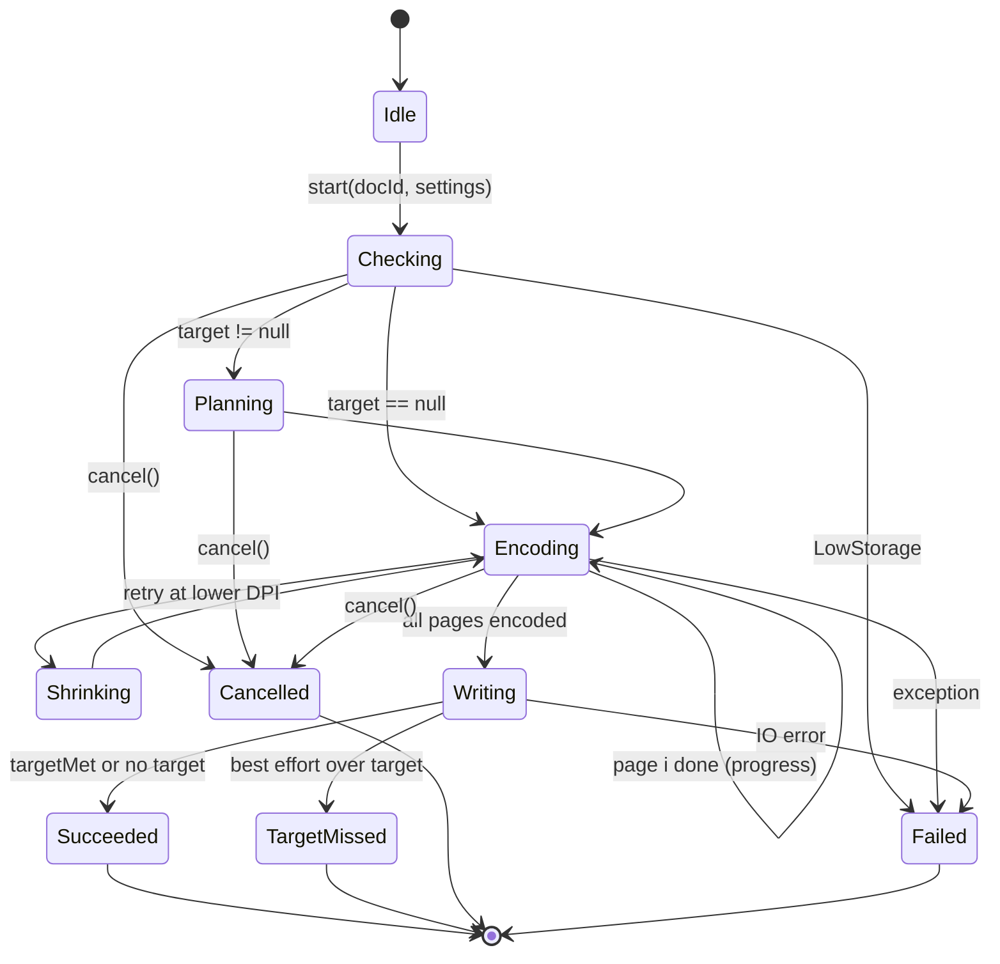

# Folio — Low-Level Design (LLD)

**Status:** Proposed for build · **Date:** 2026-10-06 · **Related:** [HLD](01-high-level-architecture.md), [ADRs](adr/)

Root package: `io.github.ukpratik.folio` (ADR-0022). The signatures below are **design contracts**, not final code. Names may change in review. Behaviour may only change via the PRD or an ADR.

---

## 1. Package layout

```
io.github.ukpratik.folio.app                      (:app)
  FolioApp, MainActivity, FolioNavHost, ShareInHandler

io.github.ukpratik.folio.core.model               (:core:model)  pure Kotlin
  Document, Page, PageId, DocumentId, Quad, PointF01, Rotation,
  EnhancementMode, Adjustments, ExportSettings, PageSize, Orientation,
  Margin, QualityPreset, ExportFormat, TargetSize, ByteSize

io.github.ukpratik.folio.core.domain              (:core:domain) pure Kotlin
  repository/ DocumentRepository, PageRepository, PreferencesRepository
  engine/     ImportEngine, ExportEngine (interfaces)
  usecase/    CreateDocument, ImportImages, UpdatePage, ApplyToAllPages,
              ReorderPage, DuplicatePage, DeletePage, RestorePage, ResetPage,
              RenameDocument, DeleteDocument, ExportDocument, ObserveRecents
  error/      FolioError (sealed)

io.github.ukpratik.folio.core.data                (:core:data)
  db/         FolioDatabase, DocumentDao, PageDao, entities, converters, migrations
  prefs/      PreferencesDataStore
  files/      FileStore, AtomicFileWriter, StorageInspector
  repo/       *RepositoryImpl
  recovery/   StartupRecovery

io.github.ukpratik.folio.core.processing          (:core:processing)
  image/      ImageNormalizer, BitmapDecoder, ExifReader, NativeLoader (OpenCV lazy)
  detect/     EdgeDetector, OpenCvEdgeDetector, QuadSmoother, FrameAnalyzer
  transform/  PerspectiveCorrector, Rotator
  enhance/    Enhancer, OpenCvEnhancer
  render/     PageRenderer, RenderRequest, RenderCacheKey
  encode/     JpegEncoder, SizeOptimizer, BudgetPlanner
  pdf/        PdfWriter, StreamingPdfWriter, PdfObjects, PageGeometry
  coordinator/ ImportCoordinator, ExportCoordinator

io.github.ukpratik.folio.feature.{home,capture,editor,export}
  <Screen>Route.kt  <Screen>Screen.kt  <Screen>ViewModel.kt  <Screen>Contract.kt
```

## 2. Domain model (`:core:model`)

```kotlin
@JvmInline value class DocumentId(val value: String)      // UUID v4
@JvmInline value class PageId(val value: String)
@JvmInline value class ByteSize(val bytes: Long)          // 1 KB = 1000 B (matches portals)

data class PointF01(val x: Float, val y: Float)           // normalised 0..1 in SOURCE space
data class Quad(val tl: PointF01, val tr: PointF01, val br: PointF01, val bl: PointF01)

enum class Rotation(val degrees: Int) { R0(0), R90(90), R180(180), R270(270) }
enum class EnhancementMode { ORIGINAL, AUTO, GRAYSCALE, BW }
data class Adjustments(val brightness: Float = 0f, val contrast: Float = 0f) // -1..1

data class Page(
  val id: PageId, val documentId: DocumentId, val order: Int,
  val sourceId: String,                 // file name in src/, shared by duplicates
  val corners: Quad?, val autoCorners: Quad?,
  val rotation: Rotation, val mode: EnhancementMode, val adjustments: Adjustments,
  val status: PageStatus, val editVersion: Long,  // bumps on every edit → cache key
)
enum class PageStatus { IMPORTING, READY, FAILED }

data class Document(
  val id: DocumentId, val title: String, val status: DocumentStatus,
  val createdAt: Instant, val updatedAt: Instant,
  val exportSettings: ExportSettings, val lastExport: ExportResult?,
)
enum class DocumentStatus { DRAFT, EXPORTED }

data class ExportSettings(
  val format: ExportFormat = ExportFormat.PDF,
  val pageSize: PageSize, val orientation: Orientation = Orientation.AUTO,
  val margin: Margin = Margin.NONE, val quality: QualityPreset = QualityPreset.BALANCED,
  val target: ByteSize? = null,         // null = None (default, D-30)
)
data class ExportResult(val path: String, val size: ByteSize, val pageCount: Int,
                        val target: ByteSize?, val targetMet: Boolean?, val at: Instant,
                        val interrupted: Boolean = false)
```

## 3. Persistence (`:core:data`)

### 3.1 Schema (Room v1)

```sql
CREATE TABLE document (
  id TEXT PRIMARY KEY NOT NULL,
  title TEXT NOT NULL,
  status TEXT NOT NULL,                  -- DRAFT | EXPORTED
  created_at INTEGER NOT NULL, updated_at INTEGER NOT NULL,
  exp_format TEXT NOT NULL, exp_page_size TEXT NOT NULL, exp_orientation TEXT NOT NULL,
  exp_margin TEXT NOT NULL, exp_quality TEXT NOT NULL, exp_target_bytes INTEGER,
  out_path TEXT, out_size INTEGER, out_pages INTEGER, out_target INTEGER,
  out_target_met INTEGER, out_at INTEGER,
  export_interrupted INTEGER NOT NULL DEFAULT 0
);
CREATE INDEX idx_document_updated ON document(updated_at DESC);

CREATE TABLE page (
  id TEXT PRIMARY KEY NOT NULL,
  document_id TEXT NOT NULL REFERENCES document(id) ON DELETE CASCADE,
  order_index INTEGER NOT NULL,
  source_id TEXT NOT NULL,
  corners TEXT, auto_corners TEXT,       -- "x,y;x,y;x,y;x,y" (TypeConverter)
  rotation INTEGER NOT NULL, mode TEXT NOT NULL,
  brightness REAL NOT NULL, contrast REAL NOT NULL,
  status TEXT NOT NULL,                  -- IMPORTING | READY | FAILED
  edit_version INTEGER NOT NULL,
  deleted_at INTEGER                     -- soft delete for Undo; purged later
);
CREATE INDEX idx_page_doc_order ON page(document_id, order_index);
CREATE INDEX idx_page_source ON page(source_id);
```

Rules:

- Ordering uses **dense integers rewritten in one transaction** on reorder. At most 100 pages, so this is cheap and avoids fractional-index drift.
- Queries filter `deleted_at IS NULL`.
- **Undo delete:** set `deleted_at`. The snackbar's Undo clears it. `PurgeDeleted` runs when the snackbar is dismissed and on app start.
- **Source reference counting:** `SELECT COUNT(*) FROM page WHERE source_id=?` after a purge or document delete. If zero, delete the file.
- `exportSchema = true`. Every migration has a `MigrationTestHelper` test.

### 3.2 DAOs (excerpt)

```kotlin
@Dao interface PageDao {
  @Query("SELECT * FROM page WHERE document_id=:doc AND deleted_at IS NULL ORDER BY order_index")
  fun observe(doc: String): Flow<List<PageEntity>>
  @Upsert suspend fun upsert(p: PageEntity)
  @Upsert suspend fun upsertAll(ps: List<PageEntity>)
  @Query("UPDATE page SET deleted_at=:now WHERE id=:id") suspend fun softDelete(id: String, now: Long)
  @Query("UPDATE page SET deleted_at=NULL WHERE id=:id") suspend fun restore(id: String)
  @Transaction suspend fun reorder(doc: String, orderedIds: List<String>) { /* rewrite order_index */ }
}
```

### 3.3 FileStore

```kotlin
interface FileStore {
  fun sourceFile(doc: DocumentId, sourceId: String): File
  fun outputFile(doc: DocumentId, title: String, ext: String): File
  fun newWorkFile(prefix: String, ext: String): File          // cacheDir/work
  suspend fun <T> writeAtomically(target: File, block: suspend (OutputStream) -> T): T
  suspend fun deleteDocumentDir(doc: DocumentId)
  fun freeBytes(): Long                                       // StatFs on filesDir
  suspend fun wipeWorkDir()
}
```

`writeAtomically` writes `target.tmp`, calls `fsync` (`FileOutputStream.fd.sync()`), then `renameTo(target)`. Every file Folio creates goes through it.

### 3.4 Startup recovery (runs once, off the main thread, after first frame)

1. `wipeWorkDir()`.
2. Pages with `status=IMPORTING` whose source file exists and is valid become `READY` (re-run detection lazily). Otherwise they become `FAILED` and are removed with a toast on next editor open.
3. A document whose export was running when the process died gets `export_interrupted=1` (tracked by a `running_export` DataStore key). The Recents row shows "Export didn't finish".
4. Purge soft-deleted pages, then garbage-collect orphan sources.

## 4. Presentation contract (UDF)

Each screen has one `Contract.kt`:

```kotlin
data class EditorState(
  val title: String = "", val pages: List<PageUi> = emptyList(),
  val importing: ImportProgress? = null, val canCreatePdf: Boolean = false,
)
sealed interface EditorIntent {
  data class Move(val pageId: PageId, val toIndex: Int) : EditorIntent
  data class Delete(val pageId: PageId) : EditorIntent
  data class Duplicate(val pageId: PageId) : EditorIntent
  data class Rotate(val pageId: PageId) : EditorIntent
  data object UndoDelete : EditorIntent
  data object CreatePdf : EditorIntent
}
sealed interface EditorEffect {
  data class ShowUndo(val pageId: PageId) : EditorEffect
  data class Navigate(val route: Route) : EditorEffect
  data class Toast(val msg: UiText) : EditorEffect
}
```

- `ViewModel` exposes `state: StateFlow<State>` (`stateIn(WhileSubscribed(5_000))`) and `effects: Flow<Effect>` (a buffered `Channel`, collected with `LaunchedEffect` + `repeatOnLifecycle`).
- The UI calls `onIntent(intent)` only. No business logic lives in composables.
- State is derived from Room Flows. `SavedStateHandle` stores only `documentId` and ephemeral UI state (selected tab, etc.).

## 5. Processing engine (`:core:processing`)

### 5.1 Interfaces

```kotlin
interface ImageNormalizer {          // import step
  suspend fun normalize(input: InputStream, mime: String?, out: File): NormalizeResult
}
interface EdgeDetector {
  fun detect(gray: Mat): Detection?  // Detection(quad, confidence)
}
interface PageRenderer {
  suspend fun render(req: RenderRequest): Bitmap        // caller must recycle
}
data class RenderRequest(val page: Page, val sourceFile: File,
                         val targetLongEdgePx: Int, val forExport: Boolean)
interface JpegEncoder { fun encode(bmp: Bitmap, quality: Int, out: OutputStream) }
interface SizeOptimizer {
  suspend fun plan(pages: List<Page>, s: ExportSettings): ExportPlan
  suspend fun encodeToBudget(bmp: Bitmap, budget: Long?, qMax: Int): EncodedPage
}
interface PdfWriter {
  suspend fun write(out: OutputStream, meta: PdfMeta, pages: Sequence<PdfPageSpec>)
}
```

### 5.2 Normaliser (import)

```
decodeBounds(stream) → w,h,mime
if mime is HEIC/HEIF and SDK < 28 → UnsupportedFormat
sample = largest power-of-2 so max(w,h)/sample ≥ 3508          // cap = A4 @300 dpi long edge
decode with inSampleSize = sample (API 28+: ImageDecoder.setTargetSize for exact cap)
apply EXIF orientation (ExifInterface on a re-opened stream)
if has alpha → composite onto white
encode JPEG q=95 → writeAtomically(src/{sourceId}.jpg)          // no EXIF written
return (sourceId, width, height)
```

Why 3508: it covers A4 at 300 dpi (High preset). Anything larger only costs memory. An ARGB_8888 at 3508×2480 is about 35 MB, the largest bitmap we ever hold.

### 5.3 Edge detection

- **Input:** 8-bit grayscale `Mat` with long edge ≤ 1024 px.
- **Camera:** take the **Y plane** of the YUV_420_888 frame directly. This needs no RGB conversion and no copy beyond row-stride handling.
- **Pipeline:**
  1. GaussianBlur(5×5).
  2. Canny(t₁=0.66·median, t₂=1.33·median).
  3. dilate(3×3).
  4. findContours(RETR_EXTERNAL).
  5. Sort by area, descending.
  6. Run approxPolyDP(ε=0.02·perimeter) and take the first convex quad.
- **Confidence:**
  - area ≥ 20% of the frame
  - not within 2% of the frame border on all sides
  - interior angles between 45° and 135°
- **QuadSmoother (camera):** exponential moving average over the last 3 detections. It drops the outline after 3 missed frames.
- **Analyzer:** `ImageAnalysis.Builder().setBackpressureStrategy(STRATEGY_KEEP_ONLY_LATEST).setTargetResolution(640×480)`, on a single-thread executor. It emits `StateFlow<Detection?>` to the camera UI, which draws the quad on a `Canvas`.

### 5.4 Render pipeline

```
render(req):
  base = decodeCached(source, req.targetLongEdgePx)        // LruCache keyed (sourceId, size) for previews only
  m = Mat(base)                                           // Utils.bitmapToMat
  try:
    if corners != null: m = warpPerspective(m, corners → rect)   // output size = avg opposite edge lengths
    m = rotate(m, rotation)                               // Core.rotate (no interpolation)
    m = enhance(m, mode, adjustments)
    return matToBitmap(m)                                 // RGB or GRAY (8-bit) bitmap
  finally: release all intermediate Mats
```

**Preview vs export:** previews request a long edge of about 1080 px and may use the cached base. Export requests the DPI-derived size and never uses the preview cache.

**Thumbnail cache key:** `"$sourceId:${editVersion}:$sizePx"`. A Coil `Keyer` and `Fetcher` call `PageRenderer`, and Coil's memory and disk caches handle the rest.

### 5.5 Enhancement (OpenCV)

| Mode | Ops (on a ≤ preview or export-size Mat) |
|---|---|
| ORIGINAL | none |
| AUTO | gray-world white balance; per-channel percentile stretch (1st–99th, from a 256-bin histogram on a 4× downsample); unsharp mask (σ=1.0, amount 0.5) |
| GRAYSCALE | cvtColor → GRAY; percentile stretch |
| BW | GRAY → fastNlMeans-lite (or a 3×3 median on low-end devices) → adaptiveThreshold(GAUSSIAN, block=odd(w/30), C=10) |
| then | `convertTo(alpha=1+contrast, beta=brightness·64)` |

### 5.6 Export geometry

```
pagePt = A4 595.28×841.89 | Letter 612×792 | Legal 612×1008 | FIT = image px / dpi × 72
orientation AUTO → swap page w/h if image is landscape and page is portrait (per page)
content box = page − 2·margin (margin SMALL = 28.35 pt)
scale = min(box.w / img.w, box.h / img.h)   // fit, preserve aspect, never crop
draw at centre:  "q {w} 0 0 {h} {x} {y} cm /Im{n} Do Q"
targetPx for render = ceil(drawn size in inches × dpi), capped by source px (never upscale)
```

### 5.7 Size optimiser (see [ADR-0011](adr/0011-target-size-compression.md))

```
presets: HIGH(300dpi,q88) BALANCED(200,q75) SMALL(150,q60); qMin=35; dpiLadder=[300,200,150,120,100]

if target == null:
  for each page: render(preset.dpi) → encode(preset.q) → work file           // 1 render, 1 encode
else:
  budget = target − overhead(≈1 KB + 0.5 KB·n)
  // Pass 1 (plan): cheap complexity estimate
  for each page: render(at 50% of preset dpi) → encode(q=preset.q) → s_i       // small render, fast
  weights w_i = s_i / Σs ; budget_i = budget · w_i
  // Pass 2 (encode): per page, sequential, carry surplus forward
  carry = 0
  for page i in order:
     b = budget_i + carry
     for dpi in ladder starting at preset.dpi:
        bmp = render(page, dpi)
        q = binarySearch(qMin..preset.q, ≤6 steps) largest q with |encode(bmp,q)| ≤ b
        if found: write bytes; carry = b − size; break
        recycle(bmp)
     if not found at dpi 100: write smallest (dpi100,qMin); carry = b − size (negative)
  targetMet = Σsize + overhead ≤ target
```

**Complexity per page:** ≤ 1 small render + ~1–2 full renders + ≤ 6–12 encodes. Encoding is libjpeg-turbo via `Bitmap.compress` and costs about 40–120 ms for 5 MP on reference devices. Memory per page stays ≤ 1 full bitmap + 1 byte buffer.

**JPG export (P1):** the same `encodeToBudget` per page, with `budget_i = target`.

### 5.8 Streaming PDF writer (see [ADR-0010](adr/0010-pdf-writer-in-house.md))

Object layout (PDF 1.4, binary-safe header `%PDF-1.4\n%âãÏÓ\n`):

```
1 0 obj  << /Type /Catalog /Pages 2 0 R >>
2 0 obj  << /Type /Pages /Kids [p1 … pn] /Count n >>                // written LAST, offset recorded
per page i:
  img_i  << /Type /XObject /Subtype /Image /Width W /Height H
            /ColorSpace /DeviceRGB|/DeviceGray /BitsPerComponent 8
            /Filter /DCTDecode /Length L >> stream <JPEG bytes copied from work file> endstream
  cnt_i  << /Length L2 >> stream q w 0 0 h x y cm /Im0 Do Q endstream
  page_i << /Type /Page /Parent 2 0 R /MediaBox [0 0 W H]
            /Resources << /XObject << /Im0 img_i >> >> /Contents cnt_i >>
info     << /Title (…) /Producer (Folio: Doc Maker) /CreationDate (D:YYYYMMDDHHmmSS+05'30') >>
xref (offsets via CountingOutputStream), trailer << /Size /Root 1 0 R /Info info >>, startxref, %%EOF
```

- Object numbers are pre-allocated, so `/Pages` can be written last.
- JPEG bytes are **streamed** from each work file using a 64 KB buffer. The PDF is never held in memory.
- Titles are encoded as a PDF text string. Non-ASCII uses UTF-16BE with a BOM (hex string), so Hindi and other scripts work.

## 6. Coordinators and state machines

### 6.1 ExportCoordinator



- **Single flight:** one export per document. A second `start` for the same document returns the existing job.
- `StateFlow<ExportState>` is keyed by `DocumentId`. The ViewModel maps it to UI states (S6, S7a/b/c, Error screens).
- **On Cancelled or Failed:** delete work files, leave the document untouched, and clear the `running_export` marker.

### 6.2 Camera permission flow

```
onScanTapped:
  granted → open camera
  !requestedBefore → show rationale sheet → request
  shouldShowRequestPermissionRationale → show rationale sheet → request
  else (permanently denied) → "Camera access off" screen (Open settings / Import)
```

`requestedBefore` is stored in DataStore, because `shouldShowRequestPermissionRationale` returns false both before the first request and after a permanent denial.

### 6.3 ImportCoordinator

- **Queue:** a `Channel<ImportJob>` consumed by `limitedParallelism(1|2)` workers.
- **Per item:** copy → normalise → detect → update the Page row.
- **Failures:** set the Page to FAILED with a reason. Failed pages are removed and summarised in a toast ("2 images couldn't be added").
- **Progress:** `StateFlow<Map<DocumentId, ImportProgress>>`.
- **Cancellation:** leaving the editor does **not** cancel the import. Deleting the document does.

## 7. Navigation routes (type-safe)

```kotlin
@Serializable data object HomeRoute
@Serializable data object SettingsRoute
@Serializable data object PrivacyRoute
@Serializable data class CameraRoute(val documentId: String?)        // null → new draft
@Serializable data class EditorRoute(val documentId: String)
@Serializable data class PageDetailRoute(val documentId: String, val pageId: String, val tab: Tab = Tab.CROP)
@Serializable data class ExportRoute(val documentId: String)          // bottom sheet destination
@Serializable data class ProcessingRoute(val documentId: String)
@Serializable data class ResultRoute(val documentId: String)
@Serializable data class PreviewRoute(val documentId: String)
```

- **Share-in:** `MainActivity.onCreate/onNewIntent` → `ShareInHandler` copies URIs immediately (the grants are bound to the intent) → creates a draft → navigates to `EditorRoute`.
- **Predictive back** is enabled (`enableOnBackInvokedCallback=true`). On Processing, back = cancel.

## 8. Error model

```kotlin
sealed interface FolioError {
  data object LowStorage : FolioError
  data class UnsupportedFormat(val mime: String?) : FolioError
  data class CorruptImage(val cause: Throwable?) : FolioError
  data object TooManyPages : FolioError                 // > 100
  data object CameraUnavailable : FolioError
  data object SaveTargetUnavailable : FolioError        // SAF target gone / revoked
  data class Unexpected(val cause: Throwable) : FolioError
}
```

- Use cases return `Result<T, FolioError>` (a small in-house `Outcome` type). Exceptions never cross the domain boundary.
- Each error maps to one entry in the UX error catalogue (UX spec §8).
- `OutOfMemoryError` in processing is caught at the coordinator. It triggers one retry at lower parallelism and a smaller cap, then becomes `Unexpected`.

## 9. Memory budget (reference device: 4 GB RAM)

| Item | Max size | Count live |
|---|---|---|
| Export render bitmap (A4 300 dpi) | ≈ 35 MB ARGB / 26 MB as an RGB Mat | ≤ 1 (≤ 2 at parallelism 2) |
| OpenCV intermediates | ≈ 1–2× bitmap | released in `finally` |
| Encoded page buffer | ≤ 3 MB | 1 |
| Preview base cache (LruCache) | 48 MB cap (≈ 8 previews @ 1080 px) | — |
| Coil memory cache | 15% of app memory class | — |
| Camera analysis frames | 640×480 Y plane ≈ 0.3 MB | 1 |

Bitmaps live in native memory on API 26+. We still bound them because the low-memory killer counts PSS.

## 10. Security hardening checklist (implementation)

- [ ] `android:allowBackup="false"`, `fullBackupContent="false"`, `dataExtractionRules` excluding everything
- [ ] Merged-manifest permission allowlist test in CI (`{android.permission.CAMERA}`)
- [ ] `FileProvider` paths limited to `documents/*/out/` and `cache/work/share/`
- [ ] Share intents grant `FLAG_GRANT_READ_URI_PERMISSION` only
- [ ] Share-in: validate MIME by sniffing magic bytes, not just the intent type. Cap the file size (e.g. 100 MB)
- [ ] Sanitise titles to `[^/:*?"<>|\\]`, max 100 characters. Never use them as raw path segments without sanitising
- [ ] Release: Timber no-op tree; R8 `-assumenosideeffects class android.util.Log { *; }`
- [ ] No WebView, no dynamic code loading, no reflection-based plugins

## 11. Test seams

| Seam | Fake / tool |
|---|---|
| Repositories | In-memory fakes in `:core:testing` |
| FileStore | `TemporaryFolder`-backed implementation |
| Processing | JVM tests with OpenCV desktop bindings for algorithms; instrumented tests for the Bitmap ↔ Mat paths |
| PdfWriter | JVM golden tests, parsed with Apache PDFBox (test-only); `qpdf --check` in CI |
| Coordinators | `TestScope` + `StandardTestDispatcher`, Turbine for Flows |
| UI | Compose UI tests; Roborazzi screenshot tests (light, dark, 200% font, 360 dp) |

## 12. Implementation notes — M1 (import pipeline)

Changes from the design above, made during implementation:

- **`page.created_at`** was added to the v1 schema. Startup recovery only touches IMPORTING, FAILED or soft-deleted rows created or deleted **before the current session started** (`SessionInfo`, injected eagerly in `FolioApp`). This stops recovery racing with a share-in import, or with an Undo snackbar, that began after launch.
- **`DocumentFiles` lives in `:core:domain`** and is implemented by `FileStore` in `:core:data`. Processing and use cases depend on the interface, so `:core:processing` never depends on `:core:data` (ADR-0005).
- **`RecoverOnStartup` is a domain use case** (pure Kotlin, tested with fakes). It is not a data-layer class.
- **Page rows are created by `AddPages`**, before the engine runs, so order is decided in the domain and the editor shows placeholders immediately. `ImportEngine` only fills existing rows. On failure it removes the row and its source.
- **Format detection is by magic bytes** (`ImageFormatSniffer`): JPEG, PNG, WebP, BMP, GIF, HEIF. HEIF uses `ImageDecoder` on API 28+. Everything else uses `BitmapFactory` plus a manual EXIF transform.
- **The downsample rule** is the smallest power-of-two `inSampleSize` that brings the long edge to ≤ 3508 px. There is no second rescale pass, which avoids a temporary second full-size bitmap.
- **Routes are owned by each feature module** (`EditorDestination`, `CameraDestination`, …). `:app` composes the graphs.
- **Share-in limitation in testing:** `adb shell am start --grant-read-uri-permission` cannot grant MediaStore URIs it doesn't own. Test share-in with a real sender app, and test import end to end via the Photo Picker.

## 13. Implementation notes — M2 (processing engine)

- **Confidence rule:** in addition to LLD §5.3 (area ≥ 20%, angles 45–135°), a quad is rejected if **any side lies along the frame border** (both endpoints within 2% of the same border). This covers screenshots, already-cropped scans and pages partly out of shot (QA T11–T13): the full image is kept.
- **Detection passes:** adaptive Canny (0.66/1.33 × median), then a low fixed Canny (30/90) for light pages on light surfaces, then Otsu. The first confident quad wins.
- **Renderer decode size** is chosen from the **cropped** area, so crops aren't under-resolved. Preview bases are cached by `(path, corners, target)` and the cache is checked before the file is touched.
- **`PageRepository.upsert` was removed.** Imports finish with a targeted `completeImport` UPDATE (status, corners, `edit_version + 1`), so a page deleted during import can never be resurrected. Edits will use similar targeted updates (M3/M4).
- **Mat lifetimes:** every OpenCV `Mat` is created through `withMats { track(...) }` and released in `finally`. `keep()` hands ownership to the caller.
- **The OpenCV version is pinned to 4.9.0.** See the ADR-0009 implementation note (SVE SIGILL on Apple-silicon emulators).

## 14. Implementation notes — M3 (page editor)

- **Thumbnails:** Coil 3 with `PageThumbnailFetcherFactory` (renders through `PageRenderer`) and `PageThumbnailKeyer` (`sourceId:pageId:editVersion:size`). **Memory cache only** (15% of the app's memory class). A disk cache isn't needed because renders at about 480 px are fast and the preview-base LRU in the renderer absorbs repeats. This differs from ADR-0016's disk cache, so revisit if scrolling large documents shows jank. The ImageLoader registers no network components.
- **Grid reorder:** `sh.calvin.reorderable` on `LazyVerticalGrid`. The visible order is local while dragging and committed **once** on drop through `MovePage`. The page ⋮ menu and TalkBack custom actions (Move left/right, Rotate, Duplicate, Delete) give the same operations without dragging.
- **Duplicate** inserts the copy and rewrites the dense order in **one Room transaction** (`insertAndReorder`). The copy shares the source file and gets a new `editVersion` timeline.
- **Undo:** `SnackbarHostState.showUndo()` in `:core:ui` keeps the snackbar for **5 s** (FR-09; M3's Short is 4 s). It is reused by later screens. Soft-deleted rows are purged by startup recovery.
- **Leaving an empty draft deletes it** (decision D-42) so Recents never shows 0-page documents. Drafts with pages show "Saved as draft".
- **Auto enhancement was rewritten** after an on-device bug: a per-channel stretch turned a blue stamp black and tinted paper yellow. Auto now white-balances from the brightest 10% of pixels (the paper; gains clamped 0.85–1.2) and applies **one** luminance-based stretch to all channels, which preserves hue. A regression test covers it.
- **Detected corners are inset by 2.5 px** (at analysis scale) to remove the thin line of table that Canny plus dilation left along the crop edges.
- **The grid has no item fade-in.** Placement animation stays for reordering. Note: the software-rendered emulator stalls frames until input, so screenshots taken without a tap can show mid-animation states. That is an emulator artefact, not an app bug.
- **Screenshot tests:** Roborazzi (Robolectric, native graphics) is wired through the feature convention plugin. Golden images live in `feature/*/src/test/screenshots/`. Record with `./gradlew testDebugUnitTest -Proborazzi.test.record=true`; verify with `verifyRoborazziDebug`.

## 15. Implementation notes — M4 (page detail)

- **Screen:** `PageDetailDestination(documentId, pageId)`, a `HorizontalPager` over the document's pages (swipe disabled on the Crop tab), with the shared header (back · Page x of n · ⋮ Reset · Done) and Crop / Rotate / Enhance tabs. It is always dark (design S4).
- **Commit model (D-29):** corners save on finger-up; mode, rotate, Auto/Full image and Reset save immediately; sliders show a **draft** at once and persist after a 150 ms debounce. The debounce flow keeps the **latest** value (`DROP_OLDEST`). A test caught an earlier version that dropped newer values and saved the first slider position.
- **Apply to all pages** writes every page in one Room transaction and returns the previous looks. Undo (5 s snackbar) restores each page exactly.
- **Crop editor:** Compose `Canvas` showing the unedited source (loaded through Coil at about 1080 px), the image dimmed outside the quad, 48 dp handles (hit radius 72 dp), and a 2× loupe drawn from the same bitmap. The maths (fit rect, mapping, nearest handle, 1% nudge) is in pure `CropMath`, unit-tested. Each corner is an invisible focusable node with TalkBack nudge actions.
- **Thumbnail cache key** is now the render inputs (source, corners, rotation, mode, adjustments, size) instead of `editVersion`. Different views of one page (the original in the crop tab vs. the edited preview) can't collide, and identical duplicates share cache entries.
- **Theme:** M3 `secondary*` roles set to teal (selected chips, nav indicator, slider tracks were baseline purple).
- **Enhancement fixes found on the device:**
  - **B&W** adaptive threshold hollowed out solid dark areas, so a filled block became an outline. Pixels below 80% of the ink/paper midpoint (Otsu split) are now kept black.
  - Mode selector: four equal icon tiles with labels underneath. Chips truncated "Grayscale" at 390 dp.
- **Known minor issue:** a faint 1 px dotted edge can remain on one side of tightly cropped B&W pages. Track in QA (T01/T10).

## 16. Implementation notes — M5 (camera)

- **Permission flow (LLD §6.2):** `CameraPermission.resolve(granted, requestedBefore, shouldShowRationale)` is pure and unit-tested. "Requested before" is stored in DataStore because `shouldShowRequestPermissionRationale` is false both before the first ask and after "Don't ask again".
  - On entry, a first-time or once-denied user sees the **S2a rationale**; a permanently denied user goes straight to **S2c**.
  - After a denial in the moment, the user sees **S2c**: Import images (Photo Picker, no permission needed) or Open settings (app-details screen).
- **CameraX:** Preview, ImageAnalysis (about 640×480, `KEEP_ONLY_LATEST`, single thread) and ImageCapture (`MAXIMIZE_QUALITY`, capped at about 12 MP). All use **4:3**, and the preview is `FIT_CENTER`, so the overlay maps directly onto a 3:4 fit rect. `ProcessCameraProvider.awaitInstance` (camera-lifecycle extension).
- **`DocumentFrameAnalyzer`** (in `:feature:capture`, an Android adapter) feeds the **Y plane** with row stride to `EdgeDetector`, then `QuadSmoother`. It rotates the result to display orientation (`FrameGeometry.rotate`, unit-tested) and computes mean luma for "More light needed".
- **Batch capture:**
  - Shots go to `cache/work/capture*.jpg` (wiped on startup).
  - Pages are created only on **Done** or **Keep**, through the same `StartDocumentFromImages` / `AddPages` use cases as imports. A new scan replaces the camera with its editor in the back stack; scanning into an existing document returns to it.
- **Safety fix:** `ConfirmDialog` gained `onDismissButton`. Previously "Discard" was wired to `onDismiss`, which also fires on outside-tap and would have silently deleted scanned pages.
- **Theme:** M3 `surfaceContainer*` roles are now neutral. Cards and sheets had a lilac tint.
- **Not yet verified:** live outline detection on a real document through the camera. The emulator's emulated camera shows a synthetic scene. The detector, rotation and smoothing are covered by tests; the end-to-end check goes to QA's device pass (T01–T14).

## 17. Implementation notes — M6 (export engine)

- **Domain:** `ExportEngine` (`states: StateFlow<Map<DocumentId, ExportState>>`, `start` / `cancel` / `acknowledge`) and the `ExportDocument` use case, which saves the sheet's settings and then starts the engine.
  - `ExportState` is `Running(phase, pagesDone, pageCount)`, `Succeeded`, `TargetMissed(result, smallest)`, `Failed(FolioError)` or `Cancelled`.
  - `FolioError.NothingToExport` is new.
- **Persistence:**
  - `ExportResult` holds the format, all output paths (newline-joined in `out_path`, plus a new `out_format` column), size, page count, target and whether it was met.
  - "Export didn't finish" is `Document.exportInterrupted`. It is set when an export starts and cleared on success or cancel; a process death leaves it set for startup recovery.
  - Room schema v1 is still unreleased, so it was changed in place.
- **`StreamingPdfWriter`:**
  - PDF 1.4 with object numbering 1 catalog, 2 pages, 3 info, then 3 objects per page.
  - JPEG bytes are copied straight into a `DCTDecode` stream, never re-encoded. The colour space is chosen from the SOF component count (Gray/RGB/CMYK).
  - Info dictionary: Title (UTF-16BE with BOM when non-ASCII), Producer and CreationDate. The xref is built from a counting stream.
  - Only one page's file is open at a time.
- **`SizeOptimizer`** (ADR-0011):
  - **No target:** every page at the preset.
  - **JPG export:** each image gets the whole target.
  - **PDF with a target:**
    - The budget is the target minus `overheadBytes` (about 520 B per page plus a fixed part).
    - **Planning pass:** each page is rendered at half DPI and encoded twice. The preset-quality size weights that page's share of the budget. The minimum-quality size, scaled by DPI², predicts which DPI ladder steps (300/200/150/120/100) can fit at all, and steps predicted to fail by more than 25% are skipped.
    - **Per page:** a binary search over quality 35…preset; unused budget carries forward to the next page.
    - **Floor:** at 100 dpi / q35 the smallest encode is kept from the same render, and the result is `TargetMissed`.
- **`ExportCoordinator`:**
  - **Concurrency and pages:** single flight per document on the processing dispatcher. It exports only `READY` pages.
  - **Free-space check:** `(target or 2 MB × pages) × 2 + 20 MB`.
  - **Files:** each page is encoded to a work file. The output is written with `writeAtomically` (temp file, then rename) into `out/`, and stale outputs from an earlier export in the other format are deleted. JPG files are named `title_01.jpg` and so on.
  - **Cancellation** keeps the previous export and clears the flag. Any other throwable, including OOM, becomes `Failed(Unexpected)`. Work files are always deleted.
- **Measured on the `folio_api36` emulator** (10 synthetic 2000×2600 "photographed" pages, every 3rd B&W):

  | Case | Result | Time |
  |---|---|---|
  | Balanced, no target | 2.9 MB | 3.4–4.8 s (NFR-04 ≤ 10 s ✔) |
  | 2 MB target, 10 pages | 1998 KB ✔ | 13.3 s |
  | 500 KB, 5 pages | 498 KB ✔ | 6.4 s |
  | 100 KB, 1 page | 98 KB ✔ | 1.2 s |
  | 100 KB, 10 pages (impossible) | 825 KB, reported as missed | 8.1 s (was 32 s before DPI prediction) |

  The synthetic pages are photo-noisy, about 82 KB each even at the floor. Real scans of printed text compress much smaller. A targeted export of 10 pages can exceed 10 s, so the processing screen (M7) must show per-page progress.
- **Tests:**
  - **JVM:** the writer is checked with PDFBox (page sizes, order, images, Gray, UTF-16 title, overhead). Optimiser: fits, carry-forward, floor, per-image. Coordinator: success, target met or missed, JPG naming and stale cleanup, cancel, low storage, nothing to export.
  - **Instrumented:** `ExportEndToEndTest`.
  - **CI:** runs `qpdf --check` on every PDF the writer tests produce (`core/processing/build/golden-pdfs/`).

## 18. Implementation notes — M7 (export UI, result, share/save)

- **Export sheet (S5)** lives in `:feature:export` but appears over the editor.
  - **Slot:** the editor exposes an `exportSheet: @Composable (DocumentId, onDismiss)` slot and `:app` fills it with `ExportSheetRoute`, so features still never depend on each other.
  - **Fresh ViewModel per opening:** the sheet uses a Hilt assisted ViewModel (`@HiltViewModel(assistedFactory)`), keyed per opening, so it always starts from the document's remembered settings. The factory takes the raw id `String`, because Hilt can't generate factories for Kotlin value-class parameters.
  - **Create:** renames the document if the name changed, saves the settings (`ExportDocument`) and starts the engine. If an export is already running, the sheet goes straight to Processing.
  - **Custom size:** validated against 50 KB – 50 MB, with an inline error.
- **Processing (S6)** mirrors `ExportEngine.states[id]`.
  - **Progress bar:** the planning pass is about 15 %, encoding about 80 %, writing the rest. The status text is a TalkBack live region ("Page 3 of 6"; "Fitting under 500 KB" while shrinking).
  - **Back:** system and predictive back both call `cancel`. On an error screen, Back simply leaves.
  - **Hand-off:** finished states are acknowledged, and a `settled` flag stops the follow-up `null` state from firing a second navigation.
  - **Low storage:** `FolioError.LowStorage` now carries `shortBy`, which feeds "Free up about 40 MB".
- **Result (S7a–c, S7e):**
  - **Data:** comes from the persisted `Document.lastExport`, so it is the same screen whether you arrive from Processing or from Recents.
  - **Target missed:** the FR-18 card shows only when it arrives with `offerAlternatives = true`; *Keep* clears that flag in `SavedStateHandle`. Reopening from Recents shows the over-limit warning badge, never a tick.
  - **Try black & white:** `ExportInBlackAndWhite` sets every page to B&W and re-exports with the same settings.
  - **Thumbnail and JPG list:** the page-1 thumbnail is drawn from the real PDF. JPG rows load through Coil from the file.
- **Preview (S7d):** `PdfPages` wraps the platform `PdfRenderer`.
  - Every call holds one lock (PdfRenderer allows one open page and isn't thread-safe). Rendering runs on the IO dispatcher, and page width is capped at 1440 px.
  - Page aspect ratios are read up front so the list lays out before anything renders.
  - Two-finger pinch zooms (1–4×) and pans horizontally; one finger keeps scrolling.
- **Share and save:**
  - **Share:** `Context.shareExport` builds `ACTION_SEND` or `ACTION_SEND_MULTIPLE` with FileProvider URIs (`<applicationId>.files`, exports only), a ClipData copy of the URIs and a read grant.
  - **Save:** `rememberSaveExportLauncher` picks `CreateDocument("application/pdf")` for a PDF, or `OpenDocumentTree` (starting at the last folder) for JPGs. Both live in `:core:ui` so Home and Result share them.
  - **Copying:** happens in the domain (`SaveExport` → `SaveDestinations`). The `:core:data` implementation uses `ContentResolver`/`DocumentsContract`, opens with `"wt"` (truncate), and maps a lost destination to `SaveTargetUnavailable` ("Couldn't save there. Choose another folder."). The snackbar shows the folder name when the provider exposes it.
- **Rename (D-44):** `RenameDocument` also renames the exported files (`ExportFileNames` in `:core:model` is the single naming rule, shared with the coordinator).
- **Delete:** `DeleteDocument` cancels a running export before deleting.
- **Recents (S1, FR-25):**
  - **Row contents:** thumbnail (first live page), name, Draft or "Export didn't finish" tag, "6 pages · 438 KB", and a relative date (Today, 2:30 PM / Yesterday / 2 Oct). Size and date formatting live in `:core:ui/format` and are unit-tested.
  - **Covers query:** a single Room query (`PageDao.observeCovers`) supplies every document's first live page and live page count.
  - **"Export didn't finish":** hidden while that export is actually running (combined with the engine state).
  - **⋮ menu:** Share and Save (exported only), Rename, Delete.
  - **Tapping a row:** a draft opens the editor; an exported document opens its Result.
- **Navigation (D-43):**
  - The Result replaces everything above Home.
  - Cancel / Back to pages / Remove pages / Edit pop back to an editor that is still on the stack, otherwise open one above Home.
  - Try B&W replaces the Result with Processing.
- **Shared UI kit:**
  - **New components:** `ChoiceChipGroup` (FlowRow FilterChips, radio semantics), `StatusBadge` and `WarningTag` (icon plus text), `RenameDialog` and `DeleteDocumentDialog` (moved from the editor).
  - **Buttons:** horizontal padding is now 12 dp, so "Scan" and "Import images" with icons fit on one line at about 411 dp.
- **Schema:** Room v1 was not changed in M7. A dev device that still holds the pre-M6 database must clear app data, because v1 is unreleased and has no migration.
- **Tests (165 JVM tests, all passing):**
  - **Use cases:** save PDF or JPGs, unavailable destination, rename renames files, B&W retry, delete cancels export.
  - **Room:** the covers query.
  - **ViewModels:** export sheet (prefill, custom range, create, already running), processing (progress, hand-off once, cancel, low storage retry, failure), result (alternatives / keep / badge, save messages, B&W, rename), home (covers, interrupted vs running, menu actions).
  - **Screenshots:** Roborazzi for S5 (light, dark with custom error, JPG), S6, both error screens, S7 success / missed / over-limit / JPG, and Home recents (light, dark) / empty.
  - **Emulator walk-through:**
    - **Export:** 3 pages under 100 KB came out at 34 KB.
    - **Result actions:** preview, Save to Downloads (`%PDF-1.4`, 33.8 KB), share sheet, rename (output file renamed), Close to Recents, reopen the Result from Recents, and delete (row and files).
    - **Missed target:** a noisy page aimed at 100 KB showed the card; Try B&W re-exported, then Keep showed the over-limit badge.
    - **JPG:** export, then Save to folder ("Saved to Documents").
  - **Not verified on the device:** cancel during processing. One-page exports finish in under a second; cancel is covered by the coordinator and ViewModel tests.

## 19. Implementation notes — M8 (settings, privacy, polish, release readiness)

- **`:feature:settings`** (D-47) owns Settings, Privacy and Licences. Home only links to them.
  - **Build facts:** `AppInfo` (`:core:model`) carries version, store link, feedback address and the licence resource id. `:app` provides it from `BuildConfig`, so features never touch the app's `BuildConfig` or `R`.
  - **Defaults (D-46):** page size and quality are saved through `PreferencesRepository`, and `CreateDocument` applies them to new documents. Page size follows the region (A4, or Letter in US/CA) until the user picks one.
  - **Send feedback:** `ACTION_SENDTO mailto:` with only the app version, Android version and phone model. The recipient is the `folio.feedbackEmail` Gradle property; if it is blank, the user types one.
  - **Rate:** opens `BuildConfig.RATE_URL` per flavour. The Play `market://` link falls back to the web listing when no store app is installed.
- **Licences:** the AboutLibraries Android plugin on `:app` runs in `offlineMode`, with no remote fetch and no timestamp in the output, so builds stay reproducible.
  - **Licence texts:** committed SPDX texts in `app/aboutlibraries/licenses/`. The bundled font is a manual entry in `app/aboutlibraries/libraries/`.
  - **Release gate:** strict mode fails the release build on any licence outside Apache-2.0, MIT, BSD-2/3-Clause and OFL-1.1. Current release set: 170 libraries (168 Apache-2.0, 2 BSD-3-Clause, 1 MIT) plus the font (OFL-1.1).
  - **Shrinking:** `res/raw/keep.xml` keeps the generated JSON from AGP 9's resource shrinking (verified in the release APK).
- **Debug only:** StrictMode (disk and network on the main thread, leaked closeables and SQLite objects; logs only) and LeakCanary 2.14 (`debugImplementation`). Release APKs still declare only CAMERA.
- **Baseline Profile (`:baselineprofile`, ADR-0019):**
  - `StartupProfileGenerator` records launch → Home → Settings. The result (about 20k rules) is merged into `app/src/main/generated/baselineProfiles/`, so both flavours ship it (`assets/dexopt/baseline.prof`).
  - **Regenerate:** `./gradlew :app:generatePlayReleaseBaselineProfile` (needs an API 33+ device or emulator).
  - **`StartupBenchmark`, emulator, 10 cold starts:**

    | Mode | Time to first frame |
    |---|---|
    | No compilation | median 4,987 ms |
    | Baseline Profile | median 440 ms (342–941 ms) |

    The NFR-03 gate (≤ 1.5 s) is measured on the reference phone.
- **Accessibility pass:**
  - Every icon-only button has a label, and icons next to text are decorative (`null`).
  - New 200 % font-scale screenshots at 360 dp cover Home recents, the export sheet and the target-missed result. They found one bug: an "Export didn't finish" tag pushed the page count off the row; that row is now a FlowRow.
  - Chip groups wrap, and the export sheet scrolls.
- **Dark theme:** screenshots in dark exist for Editor, Export sheet, Result, Home and Settings. Page detail and Camera are always dark.
- **CI:**
  - **`ci.yml`:** licence gate (part of the release build) and size gate (`scripts/check-size.sh`: bundletool `get-size total` per ABI, fails above 25 MB). Current Play download: arm64 11.0 MB, armeabi-v7a 10.0 MB.
  - **`nightly.yml`:** runs `:core:processing:connectedDebugAndroidTest` (the OpenCV pipeline and export end-to-end) on an x86_64 API 34 emulator. The app APK is ARM-only, so device tests live in library modules.
- **Release smoke test:** the R8-minified Play release, signed with the debug key, installed and worked on the emulator (licences screen, import, export to PDF).
- **Tests:** 175 JVM tests passing, including CreateDocument defaults, Settings ViewModel, and Settings/Privacy screenshots in light and dark.

## 20. Feedback round 1 (device testing, 7 Oct 2026)

- **Crop handles (S4a) felt laggy.**
  - **Causes:** the drag used `detectDragGestures`, which waits for touch slop (about 8 dp) before moving, then snapped the corner under the finger. Also, every move recomposed the editor, including the four TalkBack handle nodes.
  - **Fix:** a custom `awaitEachGesture` + `drag`, so the corner moves from the first touch and keeps the finger-to-handle offset (no jump). The working quad is read only in draw and layout lambdas (`Canvas`, `Modifier.offset {}`), so a drag only redraws.
- **Save to device** on the Result screen is now a full-width filled button directly under Share. Rename and Edit stay as small actions.
- **Feedback email** is pre-filled through `EXTRA_EMAIL` as well as the `mailto:` address, because some email apps read only one. Previously the address was URL-encoded (`%40`), which some apps don't decode. Folio has no internet, so the user still taps Send in their email app.
- **Update prompts (D-48):**
  - **Check:** `AppUpdates` (domain) runs on every `onResume`.
  - **Rule:** `DecideUpdatePrompt` (pure, unit-tested) returns REQUIRE for Play priority ≥ 4. Otherwise it returns OFFER, respecting `UserPreferences.updateReminder` (every launch / daily / weekly) and the time of the last "Later".
  - **Implementations:** `src/play` uses `PlayAppUpdates` (Play Core `app-update-ktx` 2.1.0, immediate flow; an update the user already started is treated as required). `src/fdroid` uses a no-op. Settings shows "Remind me about updates" only when `AppInfo.supportsUpdatePrompts`.
  - **Gates:**
    - The licence allowlist permits `PCSDKToS` only for `com.google.android.play` and `ASDKL` only for `com.google.android.gms`.
    - The F-Droid runtime classpath has 0 Google artifacts.
    - Both release APKs still declare only CAMERA, and the Play download is 11.0 MB.
  - **Testing:** in-app updates only work for builds installed from Play, so use Play's internal app sharing or the internal testing track. Sideloaded builds skip the prompt silently.
- **Dependabot:** ignores `org.opencv:opencv` (pinned at 4.9.0, ADR-0009 note).
